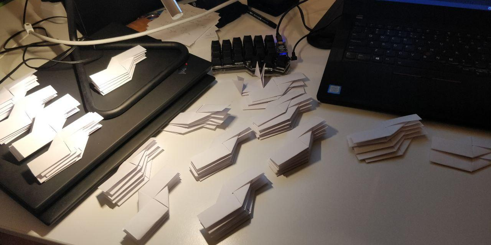
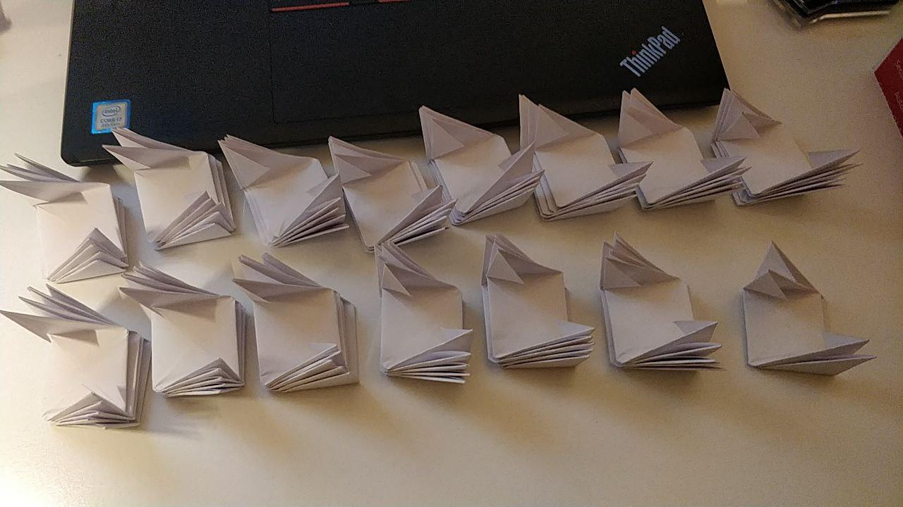
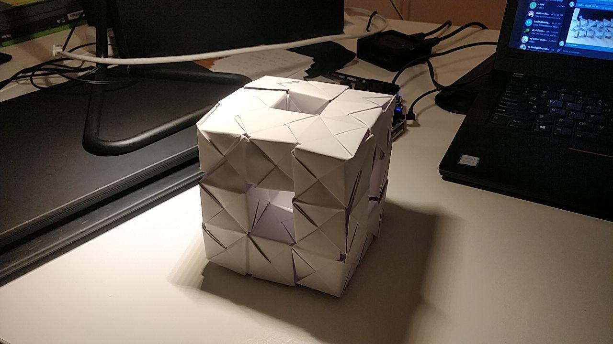
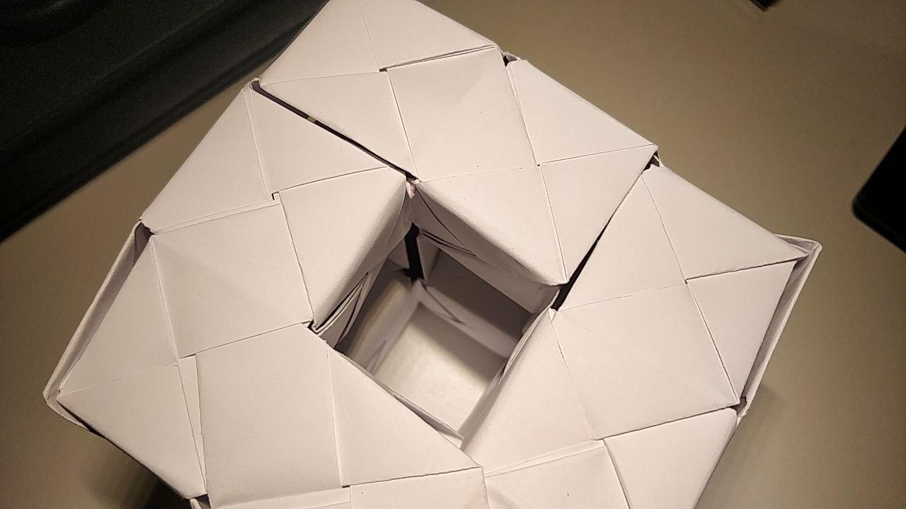
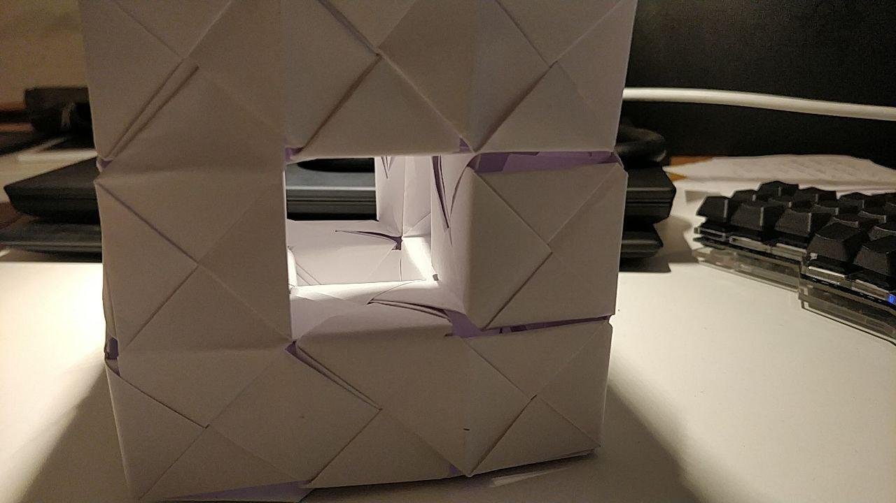
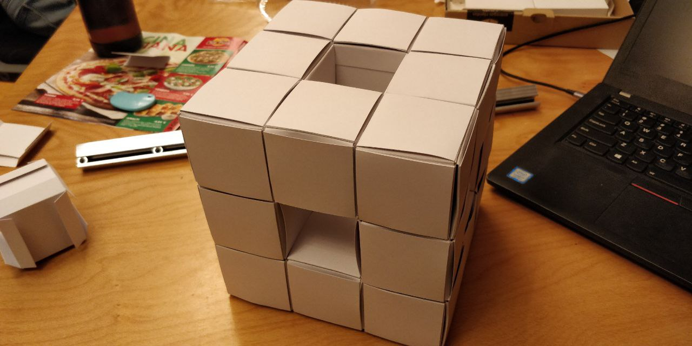

# Menger Sponge

:::toc

A Menger Sponge ist a fractal curve with a surface area approching \infty while the volume approches 0 for higher order Merger sponges.

This seemed interesting, so I built one out of paper.

Fold 72 sonobe:  

Insert the individual sonobe together to form the merger sponge: 

Next step: Build a level 2 menger sponge (left as an exercise for the reader).

## using blank business cards

A sturdier variant can be build using blank business cards:

## cards needed

The amount of cards needed can be calculated using one of the formulas described in [A212596](https://oeis.org/A212596), for example

> f(n) = 4 * (8^n + 2 * 20^n)

### level 0

(cube)

> #

12 cards

### level 1

(cube with a hole made out of cubes)

> ###
> # #
> ###

192 cards

### level 2

(cube with a hole made out of cubes with hole made out of cubes)

> #########
> # ## ## #
> #########
> # #   # #
> #########
> # ## ## #
> #########

3456 cards [source](https://theworld.com/~j9/sponge/)