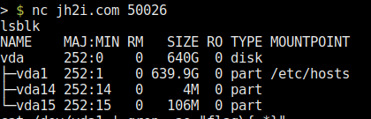
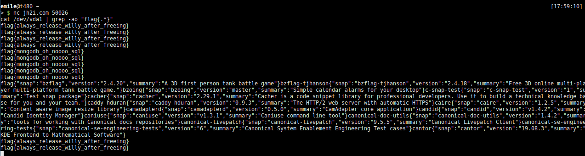
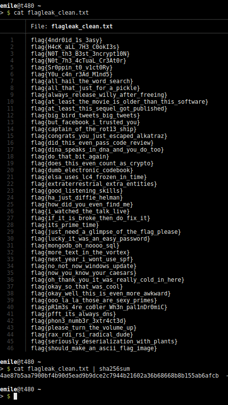

# complete-flag-leak

So, let's get things strait: yes, it is possible to leak all flags in a CTF and yes, people have done bad stuff with the leaked flags in the past resulting in a kind of broken CTF. In contradiction to this, this post will address how this was done in the NahamCon CTF, how it was disclosed, and what I've learned from this.

## Timeline

(time relative to the start of the CTF)

TIME	  WHAT
+00:59h	  Leak of the first flags
+01:01h	  Question in the discord asking for an admin
+01:05h	  Information regarding the leak and the challenge given to admin
+01:09h	  Challenge removed from CTFd and also not accessible anymore

## NahamCon CTF

So let's start, my leak of all flags in the NahamCon CTF. Leaking the flags could be done using the "Fake File" (Misc) challenge.

### The leak

The leak is done by reading from the vda1 block device:

lsblk output

The leak is actually so simple that I'm always astonised that it actually works. Let me present:

; nc jh2i.com 50026
cat /dev/vda1 | grep -ao "flag{.*}"
…

So what we do, is we read from the blockdevice and grep for the flag format. It's literally as simple as that.

Here's a screenshot displaying the raw result:

So after taking this screenshot, I waited about a minute to see if there was more and there was.

I extracted all flags from the dump like this:

; cat flagleak.txt | grep -o "flag\{\w{1,50}\}" | sort | uniq > flagleak_clean.txt

and proceeded to tweet the sha256sum of the flagleak_clean.txt file (functioning as a proof this happened about 1.5h after the CTF started):

https://twitter.com/HanEmile/status/1271481929796333570?ref_src=twsrc%5Etfw%7Ctwcamp%5Etweetembed%7Ctwterm%5E1271481929796333570%7Ctwgr%5E%7Ctwcon%5Es1_&ref_url=https%3A%2F%2Ftildeho.me%2Fleaking-all-flags-in-a-ctf%2F

Here a screenshot of the flag leak for verification:

(Sidenote: the CTF did contain flags starting with the flag format JCTF{.*}. These aren't included in the leak, as I simply grepped for the the other flag format flag{}. Also, flags not following a flag format are not in the leak. All of these could have been found, but dumping all of the data accessible (600GB+) wasn't my intention).

## Disclosure

So as you might realize, leaking all flags isn't good, not even a bit. It is "sort of a game-critical thing".

So the first thought was "I've somehow got to inform the people hosting the CTF". The first step was to join the plattform used to communicate with the admins, in this case discord. As I was pretty excited about the finding and wanted to reach one of the admins as quickly as possible, I simply mentioned that I'd leaked all flags and who I could this report this to in the main thread (This is one of the thing's I'd do different if something like this happens again, I'll get to this in the learnings section below).

After about 10 seconds, an admin reached out to me regarding this. I disclosed leaking all flags, in which challenge it happened and the admins took care of taking the challenge down. This was done in about a minute.

Overall, the response from the admins was great and I'd love to see such a response whenever something like this happens.

## Learnings

As mentioned before, I started reaching out to the admins directly in the main thread even mentioning that I'd leaked all flags. The admin I then PMd told me to please delete this message, as it might discourage other players from playing the CTF when knowning that all flags had been leaked.
I deleted the message as soon as I got the message, realizing that informing all players that all flags had been leaked might really not be the best thing to do, as it really might ruin the CTF for a lot of people.

### What to do if you leak flags

So here some points on what you should do when finding out you've leaked all flags:

- contact the admins ASAP
- don't inform all players publicly, if you do, coordinate this with the admins

### The stream

Later on, I saw that the admins were actually streaming them hosting the CTF, so If you'd like to see how the mood drops when getting informed that all flags are leaked, watch that here:

https://youtu.be/JfJsstRt3r4?t=4230

(starting at 1:10:30)

Overall, the disclosure was great, the admins acted fast and in the end, I think that nobody was really affected by this, as the challenge went up again some time later (fixed).

All in all, flag leaks such as the ones in TJCTF and PragyanCTF are really bad for a CTF and I really hope that such leaks don't happen or get reported to the admins resposibly so that the hundreds of teams and thousands of people playing such CTFs still can have some fun.

PS: (I still don't have the flag for the Fake File challenge, as I don't know which of the 65 flags belongs to that challenge)