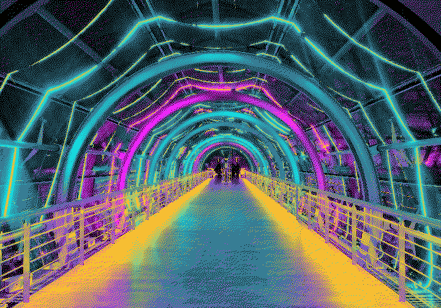

# 34c3

My first Chaos Communication Congress.

We stayed at the "Hostel Viktoria" for 15e a night which was quite an experience, as I'd never seen such a bad "hostel". You can think of it as: take a building which was unoccupied for 1000 years, add some doors, some locks, place some beds in it and then market it as a "hostel".

The worst part: they built in the locks the wrong way, so you could just take any kind of card and open the front door by pushing the card through the space between the door and the frame (by the mars on the door and the frame, we weren't the only ones that did this, as it was much more convinient than sharing a single key with like 7 people).

In addition to the hostel being kind of weird, we were greeted by people being in the small flat we got, so we had a bit of delay in order to figure out what to do (although to the defence of the people doing this, it worked out).

## The event itself

Glorious.

Congress is just another world and there isn't anything even remotely simmilar which could functions as a way to compare it.

</pre>

    </img>
    [https://flic.kr/p/EXorJq](https://flic.kr/p/EXorJq)

</pre>

