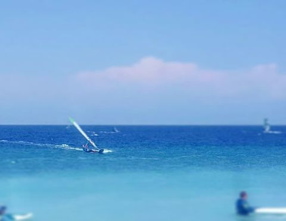

# Rhodos - Windsurfing

Went windsuring in Rhodos for 10 days. Just amazing. 10 Days of *perfect* wind every single day is just another level of paridise.

Starting the day off with 5.8m^2, the wind got more and more, so after about 14:00, I switched to 4.8m^2. At the end of the day, say 18:00, the wind got so much that most people switched to 4.2m^2 or even smaller, but as I didn't have such small sails with me, I just continued riding 4.8m^2 slightly overpowered.

</pre>

    

</pre>

