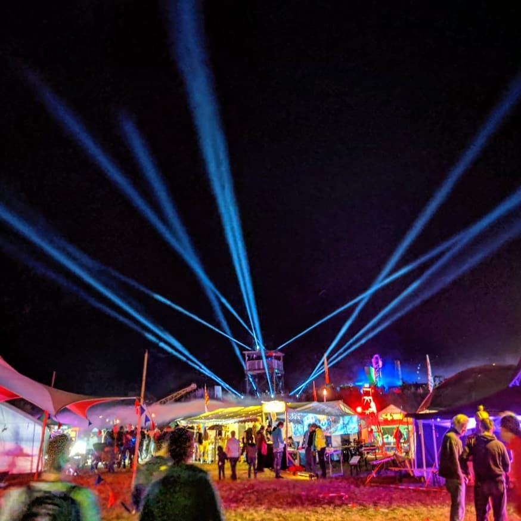
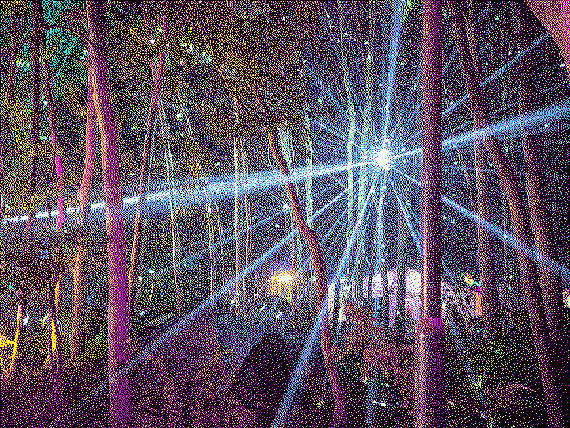

# CCCamp19

The first open air event I attended. 10/10 would do again.

</pre>

    </img>

</pre>

## Ticket, Location, Place

I wasn't sure if I could attend the event, as it collided with a University event which was planned to take place every second day of the month of August for the full month. As you can imagine, this didn't align with the camp schedule, as I couldn't simply skip 4 of those days (2 actual days) in order to attend the camp, due to all of the days being mandatory (sidenote from 2022-01-01, this was one of the things that really annoyed me at the HHU). Now doing such a course every second day for a whole month just didn't really sound intriguing, so I looked into if there would be better options, and found out that I could also do it every day for two weeks (they described it as hard, altough I've got to say that the whole thing was kind of a joke). Doing this for two weeks before the month of August made it a lot nicer, as I then had 2 weeks of free time to do stuff (for example attend the camp). Now the problem was: due to me not knowing if I would have time or not while the camp tickers were sold, I didn't buy a ticket.

On the day before the camp, I was sitting in the local hackspace realizing that nobody was there, due to all the people being at the camp, and I started asking myself why I wasn't attending the camp. by reading the paragraph of text above, you now know, so I was bummered and started looking if I could attend it nevertheless. 

Turns out: you can, although it is quite weird.

I went on and bought a ticket from the ticket-swap in the camp wiki from a person who couldn't attend the camp. Now the only stuff needed to do as with every event was to plan how to get there and where to stay. Getting there was "fairly" simple:

- U79     | to DUS HBF
- RE      | DUS HBF to Hagen HBF
- IC      | Hagen HBF to Berlin HBF
- S-Bahn  | Berlin HBF to Mildenberg 
- Car     | Mildenberg to Camp

Finding a place to stay at a camp is a lot easier than with other events, as you only need to setup a tent. Luckily, I was able to find someone (dodo) who was kind enough letting me sleep in his tent, so the only thing I had to bring was a sleeping bag and a inflatable mattress (I can highly recommend the ones from Decathlon which are about 20cm thick when inflated and amazing, although don't forget to bring a pump, as I didn't and had to learn the hard way that inflating it using your lungs is possible, but not nice).

Getting back was another thing: I just drove with dodo and some other people who also wanted to get back to DUS.

## The event itself

Amazing.

Like really: it was a superb event. The location was amazing, the weather was great, the people were even better, the whole setting was just perfect.

I'd highly recommend attending such an event if you've got the opportunity to

As I arived at about 01:00 on day 1, the whole camp was pretty much built up and I stumbled around trying to get to know the place. Now relative to other events which take place indoors, the camp is gigantic, so it took a lot of time and just wandering around interacting with other people and the things they did just never got boring.

After ariving, I quickly found the "Eat Sleep Dragon Sector Pwn Repeat" tent, a tent setup by the "Eat Sleep Pwn Repeat" and "Dragon Sector" CTF team. In there, I quickly got into a nice chat with some people from the "Los Fuzzys" CTF Team from Graz and we talked along until about 05:00 in the morning (It did get cold).

</pre>

    </img>
    [https://flic.kr/p/2h8deTX](https://flic.kr/p/2h8deTX)

</pre>

