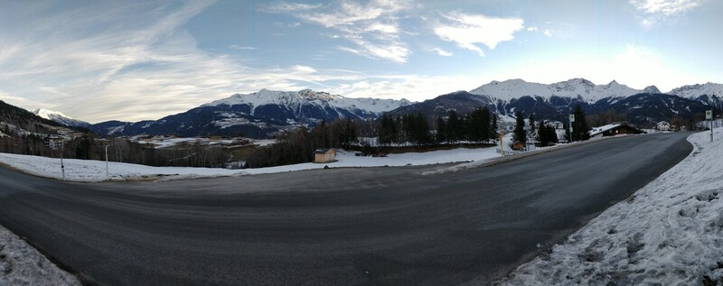

# 2022-01 Ski Fiss Ladis

:::toc

total
vertical  down: 61.445km  up: 60.759km      total: 122.205km 
distance  down: 334.6km   up: 222.8km       total: 557.4km

## Day 1 (2022-01-02 (sun))

[full-res-image (8 MB)](./IMG_20220102_084023.jpg)

speed     min: 0.0 km/h   max: 101.1 km/h   avg: 11.5 km/h
altitude  min: 1264m      max: 2869m        avg: 2126m
vertical  down: 8204m     up: 7838m         total: 16043m
distance  down: 44.2km    up: 28.0km        total: 72.2km
misc.     runs: 19        min slope: 12.1°  max slope: 38°

Super nice weather, although it got really warm in the afternoon (8°C).

[gpx track](./sportler_track_1-2-22_09-588262521426935870635.gpx)

## Day 2 (2022-01-03 (mon))

[full-res-image (1.9 MB)](./IMG_20220103_120424.jpg)

speed     min: 0.0 km/h   max: 91.4 km/h    avg: 11.8 km/h
altitude  min: 1269m      max: 2878m        avg: 2028m
vertical  down: 8133m     up: 8152m         total: 16285m
distance  down: 47.2km    up: 31.0km        total: 78.0km
misc.     runs: 20        min slope: 8.4°   max slope: 16.8°

Nice in the morning, some snow and clouds around the mid of the day and icy conditions at the end.

[gpx track](./sportler_track_1-3-22_09-202728502098809034503.gpx)

## Day 3 (2022-01-04 (tue))

[full-res-image (2.7 MB)](./IMG_20220104_123448.jpg)

speed     min: 0.0 km/h   max: 86.9 km/h    avg: 12.5 km/h
altitude  min: 1275m      max: 2862m        avg: 2075m
vertical  down: 9051m     up: 9034m         total: 18085m
distance  down: 52.0km    up: 35.1km        total: 87.1km
misc.     runs: 21        min slope: 10.7°  max slope: 26.0°

Really full in the morning, got better in the afternoon. Weather wise ok, got kind of dark in the afternoon.

[gpx track](./sportler_track_1-4-22_09-217234164266262352192.gpx)

## Day 4 (2022-01-05 (wed))

[full-res-image (3.8 MB)](./IMG_20220105_080027.jpg)

speed     min: 0.0 km/h   max: 75.0 km/h    avg: 14.2 km/h
altitude  min: 1274m      max: 2549m        avg: 2070m
vertical  down: 9958m     up: 9709m         total: 19667m
distance  down: 55.0km    up: 36.8km        total: 91.8km
misc.     runs: 22        min slope: 11.6°  max slope: 47.5°

New snow, resulting in really bad viewing conditions with perfect riding conditions. Stayed like that all day long.

[gpx track](./sportler_track_1-5-22_09-279105235435107604284.gpx)

## Day 5 (2022-01-06 (thu))

[full-res-image (2.1 MB)](./IMG_20220106_124442.jpg)

[full-res-image (2.2 MB)](./IMG_20220106_135737.jpg)

speed     min: 0.0 km/h   max: 85.4 km/h    avg: 15.7 km/h
altitude  min: 1258m      max: 2798m        avg: 2028m
vertical  down: 12114m    up: 12238m        total: 24352m
distance  down: 64.7km    up: 44.6km        total: 109.3km
misc.     runs: 24        min slope: 9.1°   max slope: 13.4°

It got colder. The viewing conditions weren't ideal and yet the snow was great.

[gpx track](./sportler_track_1-6-22_09-066127438439762856324.gpx)

## Day 6 (2022-01-07 (fri))

[full-res-image (2.3 MB)](./IMG_20220107_125406.jpg)

speed     min: 0.0 km/h   max: 106.0 km/h   avg: 17.3 km/h
altitude  min: 1333m      max: 2868m        avg: 2118m
vertical  down: 13985m    up: 13788m        total: 27773m
distance  down: 71.5km    up: 47.3km        total: 118.7km
misc.     runs: 27        min slope: 12.2°  max slope: 61.9°

The conditions were perfect in the morning, grippy snow and no ice. Until around 14:30, there were almost no clouds and a lot of sun, then the weather got cloudier and the contrast dropped.

[gpx track](./sportler_track_1-7-22_09-142230253560393793682.gpx)