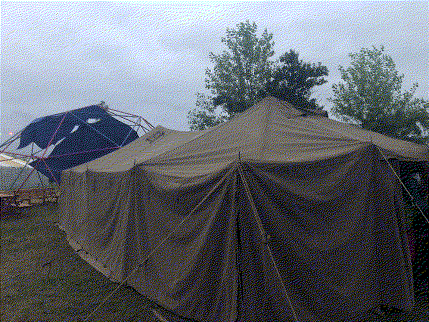

# mch 2022

My second event with milliways, fun as it can be. Some people had covid after a
few days, so I kind of organized the teardown onsite (which was super chaotic).

We had a lot of stuff that had to get back to the storage in unna, but no transport. The nice people from geraffel were heading in that direction, so they allowed us to fill their van with some of our stuff (which turns to be out a lot). As not everything would fit into the van just like that, we added more stuff to another geraffel transport which we unloaded in Unna as well.

Overall super chaotic, but the event was just worth it.

Oh: I helped build up and then tore down the dome (and build up the benches which was amazing due to mc.fly's bosh professional equipment, spax + schlagbohrer is just such a good combination!)

[https://mch2022.org/](https://mch2022.org/)

</pre>

    
</img>

</pre>

