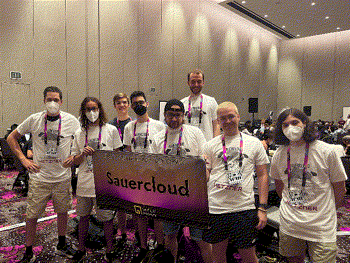
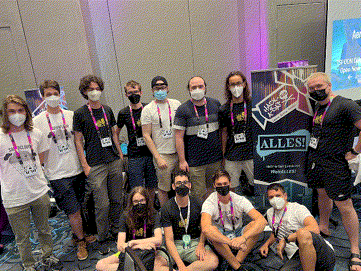

# DEFCON

We qualified for the CTF Finals (came 3rd in the quals) and came in 14th. Was kind of due to the fact, that we were a merger of a lot of teams that had nevery played with each other or even played attack and defense.

[DEFCON](https://defcon.org/)

</pre>

</img>

Part of the Sauercloud team in the CTF Area

 

</img>

ALLES! team at the hackasat booth

</pre>

