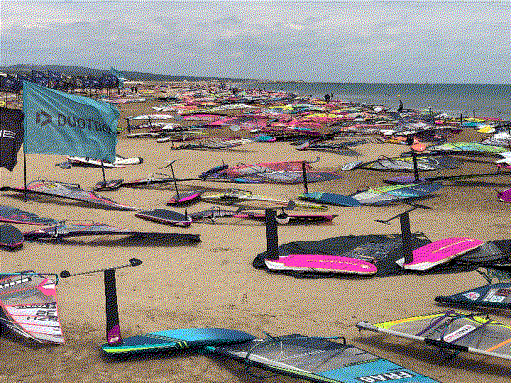
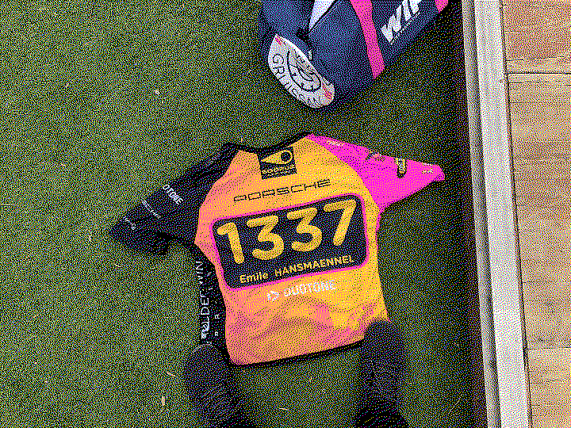
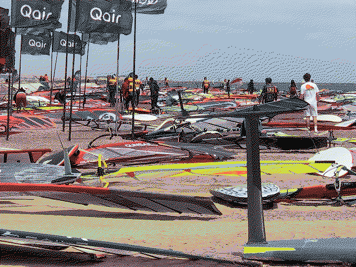
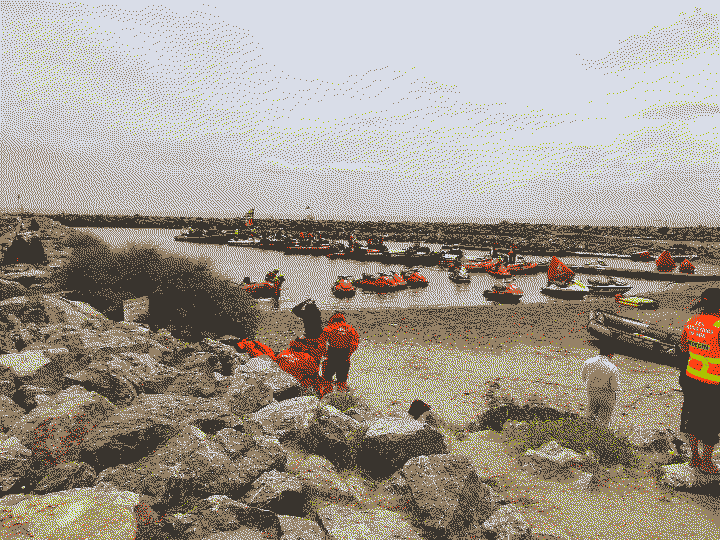

# DEFI WIND

:::toc

## Experience

THAT WAS AMAZING.

So each race is ~40km long with 4 runs being each about 10km long. On the first reach, I went **way** to much downwind (due to the amount of people around me limiting me in speed, thus not getting into planning and thus having to go downwind in order not to sink), but after seeing the first yellow buoys in the distance, I went as far upwind as possible in order to reach the first jibing mark. That mark was filled by an aweful lot of people that had fallen trying to jibe directly around it (which is so dump tbh., like you just rode 10km, jibing 100 or 200m further out won't make a difference for the mid to late field).

The second reach (back from the first jibing mark to the start) was AMAZING. Like: on the first reach, I thought about just riding back the the beach and calling it a day, but the second reach with a slight broad reach course keeping close to the beach was insanely fun. Just blasting seemingly downwind just limited by yourself (Like: I could probably have gone faster, but I felt fast enough and didn't want to loose control, this is a marathon like event in the end, so a "slow" (it wasn't slow) and steady ride is preferable).

### Material choice:

- 95l nove nove slalom board
  - 30cm fin
- 4.7m² gun sails yeah freestyle sail (I tried the 5.6m² slalom sail, Just to much for my 60kg).
  - The noerstick helped nicely swapping the sails out, first time I tried it and worked really well!
  - Also: getting the sail perfectly trimmed was a breeze: I've often had the problem of having a *slightly* too long mast-extension and thought of building something like the noerstick. Now that I've used it: it really is that one innovation that adds some more fun to the whole process. (Yes, you could just spend some time rigging and de-rigging the sail a few times in order to find the perfect distanct, but this is just so convinient).

### Wind

So there really is 20 knots of wind down there. By 20 knots, they mean 20 knots. In Angermund (north of Düsseldorf) at the small lake, when the prediction says 20 knots, there aren't 20 knots reaching the lake, more like 16. Now 20 knots of wind are amazing, but the round about 10 knots extra you get at port-la-nouvelle are insanely fun (and terrifying). As you start realizing the jibe mark is coming up soon, the wind starts to pick up, you overpower and just go into the jibe with SO MUCH pressure.

## Information

[https://www.windmag.com/defi-wind](https://www.windmag.com/defi-wind)

Dossard: 1337
Rank Overall: 868
Rank Sexe: 820
Rank Catégorie: 210

Points Total	2405,0
Points Run 1	506,0
Points Run 2	1013,0
Points Run 3	886,0
Points Run 4	---1421,0---
Points Run 5	

As you can obviously see, my positioning is slightly behind the mid of all participants (which I'm even astonished about). The goal for next year (yes, I'm going to do this again, seriously, it's that fun) is to just top that. I've learnt a lot and would just like to improve on this. Now there could be some issues: a lot more wind, a lot more waves, whatever the world throws at us, but in the end: I'd love to give it a shot!

## Pictures

[full-res-image (14 MB)](a.png)

[full-res-image (19 MB)](b.png)

[full-res-image (11 MB)](c.png)

[full-res-image (13 MB)](d.png)
