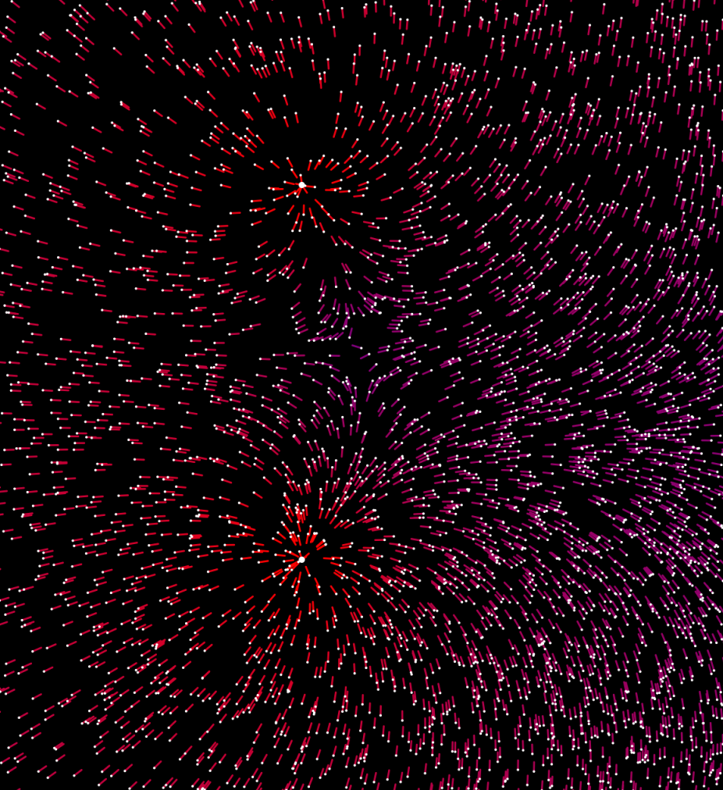

# Galaxy Simulation (2019)

After having generated multiple galaxies, I realized that it would be fun to do stuff with the stars.

The image above shows two heavy masses in a field of stars. The direction of the force acting on the stars is dispalyed using the line pointing away from the individual star. The intensity of the force acting is depicted using colors (blue=low force, red=higher force).

If you find this interesting and want to read a comprehensive introduction on how this works, you can read the [Paged Out!](https://emile.space/projects/paged-out/) article I wrote about this.

- [https://git.darknebu.la/GalaxySimulator](https://git.darknebu.la/GalaxySimulator)
- [langfassung](./langfassung.pdf) (pdf, 292 KB)
- [posters](./posters.pdf) (pdf, 1.3 MB)
- [series](./series.pdf) (pdf, 409 KB)
- [tree](./tree.pdf) (pdf, 45 KB)

## quadtree

The below quadtree contains a single star in each cell:

### 50 stars

[dark version](./barnes-hut-tree-50.png)

### 1000 stars

[dark version](./barnes-hut-tree-1000.png)

