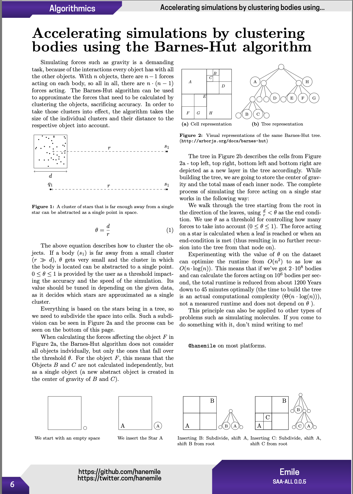

# Accelerating simulations by clustering bodies using the Barnes-Hut algorithm

A one page writeup of my Jugend-Forscht project from the beginning of 2019.

Read the page [here](./barnes_hut.pdf) or the whole [Paged Out! Issue 1](https://pagedout.institute/download/PagedOut_001_beta1.pdf).

[barnes_hut.pdf](./barnes_hut.pdf)
