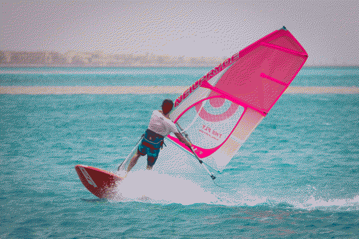
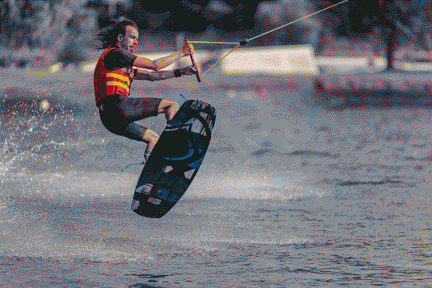

# sport

> An activity involving physical exertion and skill in which an individual or team competes against themsel(f/ves), another or others for entertainment.

- [Wikipedia - Sport](https://en.wikipedia.org/wiki/Sport)

</pre>

    

        </img>
    

    

        </img>
    

</pre>

