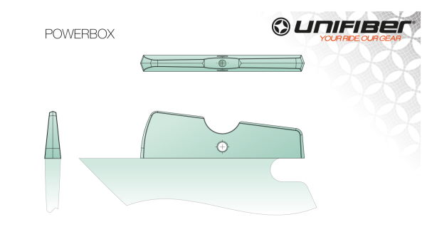
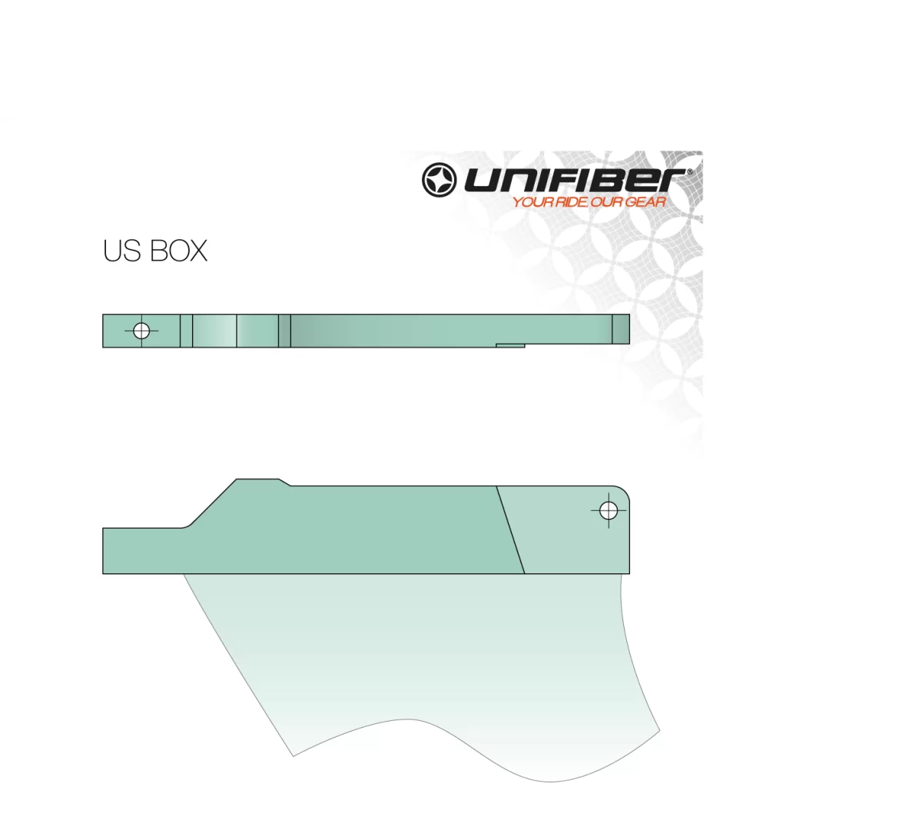
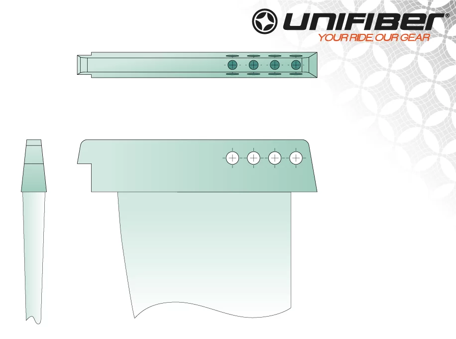
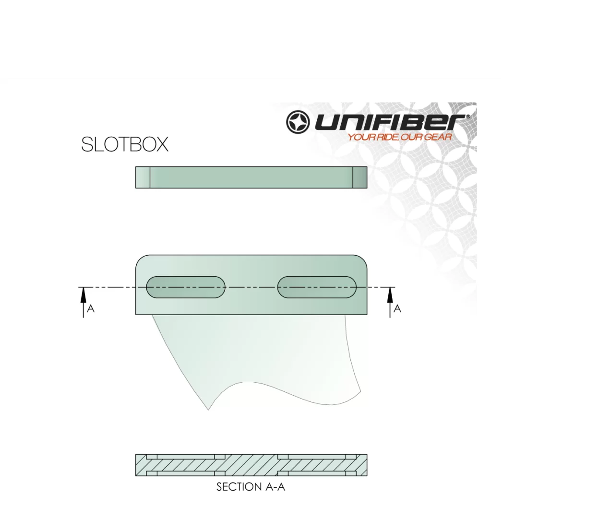
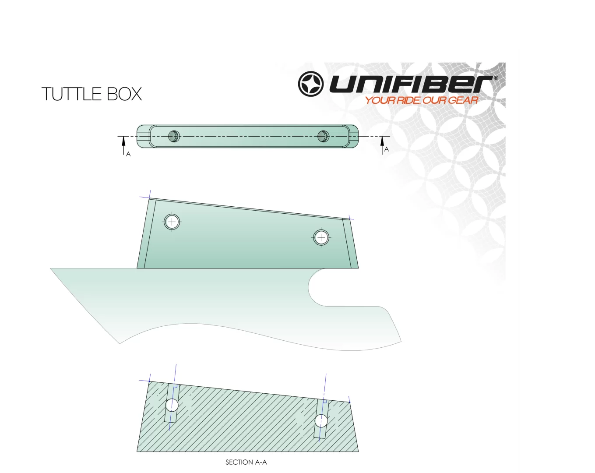
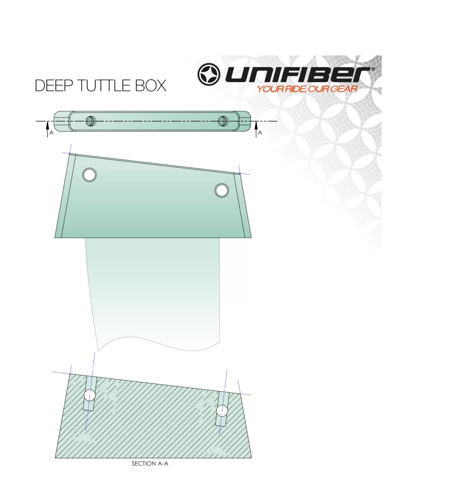

# fin

So there are a lot of fin systems that have been designed over the years, each with their own advantage and disadvantages.

:::toc

All images from the [unifiber.net/windsurf-fins](https://www.unifiber.net/windsurf-fins) page.

## Powerbox

</img>

## US-Box

</img>

## Trimbox

</img>

## Slotbox

</img>

## Tuttlebox

</img>

## Deep Tuttlebox

</img>
